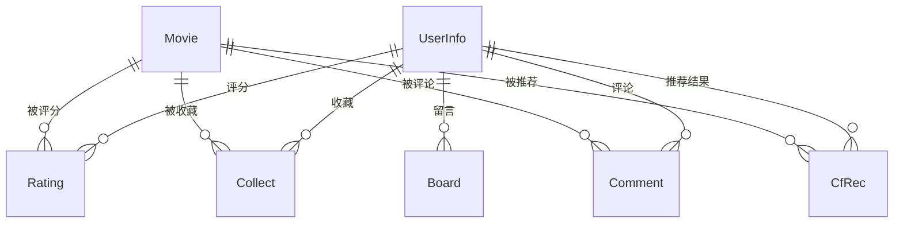

# Movie Recommendation System / 电影推荐系统

基于 Django 的全栈电影推荐平台，1600+ 行核心业务逻辑，集成协同过滤推荐算法与完整后台管理系统。

> **全栈项目**  | 2025.11-2026.02

---

## 项目概览

### 功能地图

| 模块 | 功能 |
|------|------|
| 用户系统 | 注册、登录（连续输错 3 次锁定 10 分钟）、登出、个人中心 |
| 电影浏览 | 首页推荐、排行榜、分类筛选（类型/地区/年代）、详情页、搜索 |
| 用户交互 | 评分（1-10 分）、收藏、评论、留言板 |
| 推荐引擎 | 协同过滤推荐（皮尔逊相关系数 + 余弦相似度）、冷启动兜底策略 |
| 管理后台 | 数据看板、电影 CRUD、用户管理、管理员管理、评论审核 |

---

## 技术栈

| 层级 | 技术选型 |
|------|---------|
| 后端框架 | Django 6.0 + 自定义用户模型（AbstractBaseUser） |
| 数据库 | MySQL + Django ORM + pymysql 原生 SQL |
| 前端 | Bootstrap 5.3（CDN）+ Django Template 渲染 |
| 推荐算法 | 协同过滤（皮尔逊相关系数 60% + 余弦相似度 40%）、用户类型偏好向量 |
| 缓存 | Django Cache（登录锁定机制） |
| 数据采集 | Python requests + lxml（电影海报爬虫） |

---

## 数据库设计

### 7 张核心数据表

| 表名 | 用途 | 关键字段 |
|------|------|---------|
| `Movie` | 电影信息 | title, score, types, regions, actors, poster, summary |
| `UserInfo` | 用户（自定义模型） | username, email(unique), nickname, sex, age |
| `Rating` | 用户评分 | user(FK), movie(FK), score, unique_together |
| `Collect` | 用户收藏 | collect_user, collect_movie, movie_information(FK) |
| `Comment` | 用户评论 | comment_user, movie, discussion, comment_score |
| `CfRec` | 推荐结果缓存 | user(FK), movie(FK), rating, unique_together |
| `Board` | 留言板 | board_user, board_message, board_time |

### ER 关系图



---

## 推荐系统详解

### 算法架构

推荐引擎采用**混合相似度策略**，融合两种互补的相似度度量：

1. **皮尔逊相关系数**（权重 60%）— 基于共同评分电影，消除用户评分偏置（有人习惯打高分，有人习惯打低分）
2. **余弦相似度**（权重 40%）— 基于用户类型偏好向量（15 个电影类型标签），捕捉口味维度的相似性

### 工作流程

```
用户请求推荐
    │
    ├── 是否有评分/收藏 ≥ 10 条？
    │   ├── 是 → 协同过滤推荐
    │   │        ├── 步骤 1: 构建用户评分矩阵（评分 + 收藏视为 10 分）
    │   │        ├── 步骤 2: 计算与所有其他用户的相似度
    │   │        ├── 步骤 3: 选取 Top-5 最相似用户
    │   │        └── 步骤 4: 加权聚合候选电影（相似度 × 评分 + 类型偏好加成）
    │   └── 否 → 冷启动兜底
    │            └── 基于用户已有的类型偏好，推荐高分热门电影
    └── 返回 Top-10 推荐结果
```

### 关键实现细节

- **评分和收藏统一**：收藏行为映射为满分（10 分），扩充稀疏的用户-物品矩阵
- **类型偏好加成**：候选电影与用户偏好类型匹配时，额外加权 0.5 倍
- **已评分/已收藏排除**：确保推荐结果不会是用户已经交互过的电影
- **冷启动防御**：新用户无足够行为数据时，降级为基于类型偏好的热门推荐

### 核心代码位置

| 函数 | 位置 | 功能 |
|------|------|------|
| `get_user_type_vector()` | `myapp/views/recommend.py` | 构建用户 15 维类型偏好向量 |
| `calculate_similarity()` | `myapp/views/recommend.py` | 计算两用户混合相似度 |
| `get_cold_start_recommendations()` | `myapp/views/recommend.py` | 冷启动兜底策略 |
| `generate_recommendations()` | `myapp/views/recommend.py` | 协同过滤主流程 |

---

## 本地运行

### 环境要求

- Python 3.12+
- MySQL 8.0+

### 安装步骤

```bash
# 1. 克隆仓库
git clone https://github.com/Johnx-w/Movie-recommendation.git
cd Movie-recommendation

# 2. 创建虚拟环境
python -m venv venv
venv\Scripts\activate  # Windows
# source venv/bin/activate  # macOS / Linux

# 3. 安装依赖
pip install -r requirements.txt

# 4. 配置环境变量
copy .env.example .env  # Windows
# cp .env.example .env  # macOS / Linux
# 编辑 .env，填写 SECRET_KEY、数据库账号密码等

# 5. 创建数据库（MySQL）
mysql -u root -p
CREATE DATABASE django_movie CHARACTER SET utf8mb4;
exit;

# 6. 数据库迁移
python manage.py migrate

# 7. 创建超级管理员
python manage.py createsuperuser

# 8. 导入测试数据（可选）
python generate_test_data.py

# 9. 启动开发服务器
python manage.py runserver
```

访问 http://127.0.0.1:8000

---

## 项目结构

```
Movie-recommendation/
├── movie/                          # Django 项目配置
│   ├── settings.py                 # 数据库/应用/中间件配置（支持 .env）
│   ├── urls.py                     # 根路由
│   └── wsgi.py
├── myapp/                          # 主应用
│   ├── views/                      # 按功能拆分的视图包
│   │   ├── auth.py                 # 登录 / 注册 / 登出
│   │   ├── movie.py                # 首页、排行、详情、搜索、收藏、评论
│   │   ├── recommend.py            # 协同过滤推荐引擎
│   │   ├── center.py               # 个人中心、留言板
│   │   └── admin.py                # 自定义后台管理
│   ├── models.py                   # 7 个数据模型
│   ├── urls.py                     # 业务路由
│   ├── pagination.py               # 自定义分页器
│   └── migrations/                 # 数据库迁移记录
├── templates/                      # 页面模板（前台 + 自定义后台）
├── static/                         # 静态资源（海报、主题 CSS/JS）
├── spiders/                        # 爬虫脚本
│   ├── get.py                      # 豆瓣电影数据采集
│   ├── download_posters.py         # 海报下载
│   └── sql.py                      # 数据入库
├── generate_test_data.py           # 测试数据生成
├── requirements.txt                # Python 依赖
├── .env.example                    # 环境变量模板
├── manage.py                       # Django 管理入口
└── .gitignore
```

---

## 技术亮点

### 工程实践

| 实践 | 说明 |
|------|------|
| **ORM + 原生 SQL 混用** | 统计类查询使用 pymysql 直接执行复合 SQL，避免 ORM 多次查询的性能损耗；常规 CRUD 使用 Django ORM 保证开发效率和安全性 |
| **登录安全** | 基于 Django Cache 的失败次数追踪 + 锁定机制，3 次错误锁定 10 分钟 |
| **自定义用户模型** | 继承 `AbstractBaseUser` + `PermissionsMixin`，替换 Django 默认 User 模型，支持昵称、性别等扩展字段 |
| **Django Forms 校验** | 登录/注册/电影管理均使用 Django Forms 进行后端校验，防 XSS/SQL 注入 |

### 推荐算法设计决策

| 设计决策 | 原因 |
|---------|------|
| 皮尔逊 + 余弦混合 | 皮尔逊消除评分偏置，余弦捕捉类型偏好，互补 |
| 收藏映射为 10 分 | 扩充稀疏矩阵，收藏行为表达高偏好强度 |
| 60% + 40% 权重 | 电影评分是显式反馈，权重应高于类型隐式信号 |
| K=5 相似用户 | 平衡计算效率与推荐多样性 |
| 冷启动降级 | 新用户无交互数据时按类型偏好推荐高分电影，保证可用性 |

---

## 待优化

- [ ] 数据看板接入统计图表（ECharts）
- [ ] 推荐结果添加可解释性标注（"因为你喜欢 XX"）
- [ ] 部署上线（PythonAnywhere / Render）
- [x] 敏感配置迁移至 `.env` 环境变量
- [ ] 单元测试覆盖核心推荐逻辑
- [ ] Collect / Comment 改为外键关联，减少字符串匹配与 N+1

---

## 作者

VyNox — [GitHub](https://github.com/Johnx-w)
